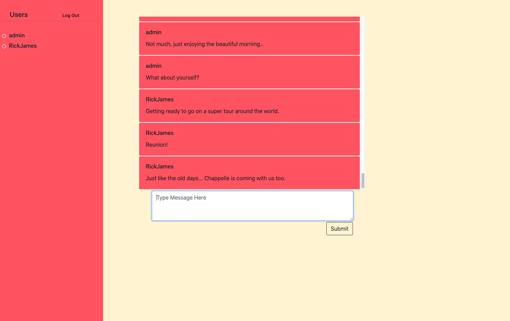

# The Chat App  

Chat application inspired by Slack and Facebook.  Users can create an account and chat with other users in the main chat channel.

## Installation Instructions

1.) Do a fork and clone of the repo to your local machine.

2.) Navigate to the `client` directory and run `npm install`.

3.) Move to the project root directory and run `dotnet watch run`.

## Tech Stack Used
* Back-End
    * ASP.NET Core 3.1
    * Npgsql
    * PostgreSQL
    * NUnit
* Front-End
    * React.js
    * Axios
    * Bootstrap
